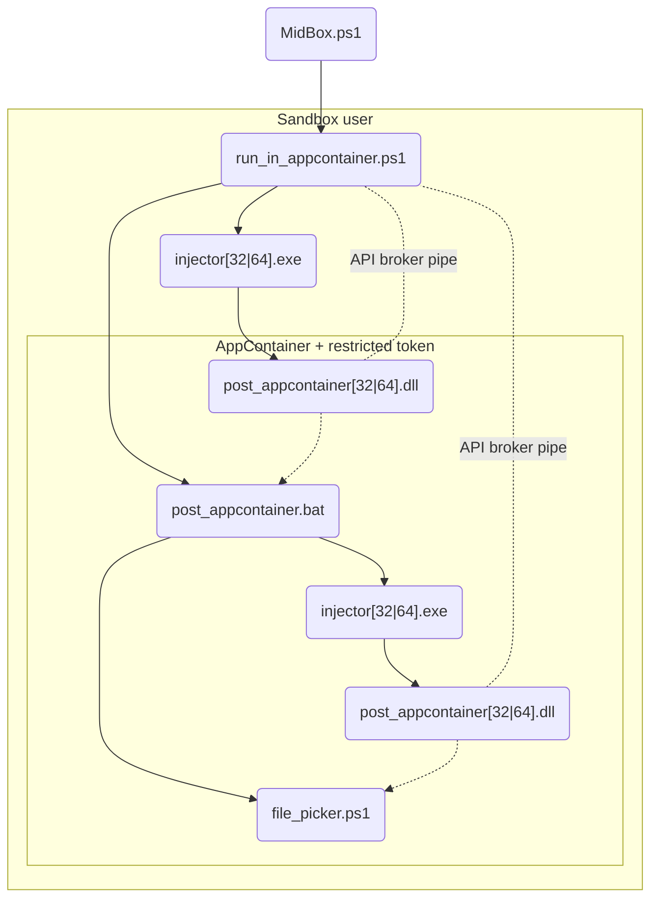

# MidBox
A lightweight (less than a megabyte) sandbox for Windows built mainly with Powershell 5 that uses users and AppContainer to isolate user level programs.

MidBox = LowBox (AppContainer's original name) + medium integrity level like access to the filesystem and other resources (with limitations)

# [Download](https://github.com/Meterel/MidBox/releases/latest)

## Requirements
Supported architectures: x86, x64

[Microsoft Visual C++ Redistributable](https://aka.ms/vc14/vc_redist.x64.exe) if you get a DLL not found error

## How it works
When you create a sandbox, a user gets created, permissions get set in its userprofile folder and its HKCU registry hive to allow access to the AppContainer and then is added to the MidBox usergroup, this usergroup has access to most of C:\\ as read only with ACLs.

When you run a sandbox, the process gets ran in the designated sandbox user and inside an AppContainer with a restricted token, and where write access isn't blocked because of missing ACLs (like on external partitions) AppContainer will block it because of its block by default nature requiring ACLs to grant access to objects. AppContainer will also block access to other processes and capabilities such as internet, clipboard, microphones, cameras etc. Meanwhile the restricted token is used to remove the grant permission on processes and threads that give the logon session (any process running on your desktop regardless of user) some priviledges like reading memory and termination, thus achieving sandbox to sandbox process isolation even though they use the same AppContainer SID.

To grant a sandbox filesystem access to a resource that is already initialized like on C:\\, you can simply right click it in file explorer then go to Properties->Security->Modify and add the name of your sandbox and below set its permissions. If access hasn't been initialized like on an external partition you'll need to initialize it trough MidBox and then you can either modify the initialized permissions to grant it access to all sandboxes or you can select a resource in it that you want it granted access only to certain sandboxes and grant it by adding permissions. Granting access to an initialized resource only to specific sandboxes isn't supported due to the deny permission on the MidBox usergroup overriding any allow permissions.

## Compatibility accomodations
Normal executables may not be designed to run in a low integrity AppContainer context, so MidBox has a few accomodations to try to make medium integrity level executables run normally.

### ACLs
* Read only access to the system drive

* Access to the sandbox's user profile

* Access to the sandbox's HKCU registry hive except to AppContainer related keys

### BAT script and the injected DLL
* Known folder paths won't redirect to the AppContainer

* Named pipes will be converted to LOCAL if needed

### API broker
* The mouse pointer can be manipolated, for example by setting the position and constraining it to "lock" it, with security checks to see if the sandboxed process has access to the focused window

* The fullscreen resolution can be changed temporarily if focused on a sandboxed window

## Limitations
Some of these limitations can be circumvented by using the unsafe and AppContainerless logged in mode.

* Programs that require Administrator priviledges aren't supported

* Programs that use AppContainer such as browsers aren't supported because their processes are already running under it

* AppX packages aren't supported

* Programs that use APIs not available in a low integrity level and that are not supplied by the API broker aren't supported

* Programs that use some network features might not be supported due to AppContainer's weird network behaviour. For example, running in an AppContainer with network capabilities, the `ping` command will fail citing a driver error, but `curl` will succeed

* Loopback not supported, but can be manually enabled to all sandboxes by using `CheckNetIsolation`

* WMI/CIM will fail due to no localhost and weird network behaviour even when access is granted to the namespace

* Some IPC will fail like by using Windows Sockets due to no localhost and weird network behaviour

## Pipeline

* MidBox.ps1 runs run_in_appcontainer.ps1 in the sandbox user
    * run_in_appcontainer.ps1 runs both suspended in the AppContainer with the restricted token post_appcontainer.bat, to set environment variables changed by AppContainer back to their original values, and then file_picker.ps1
    * run_in_appcontainer.ps1 runs injector[32|64].exe to inject post_appcontainer[32|64].dll and then resumes them, this is to hook functions for compatibility agevolations and also to hook the process creation function to inject itself in new processes
    * run_in_appcontainer.ps1 hosts the API broker for post_appcontainer[32|64].dll to connect to, to restore some APIs not available in this restricted context